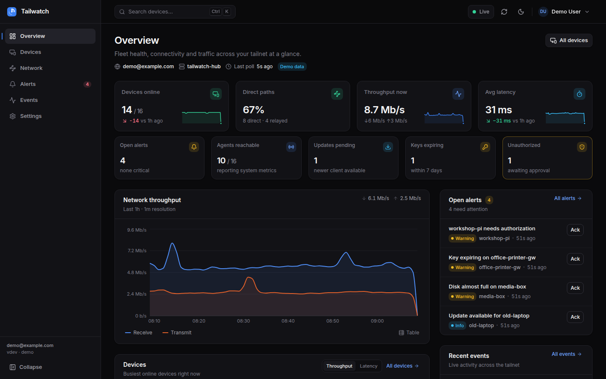
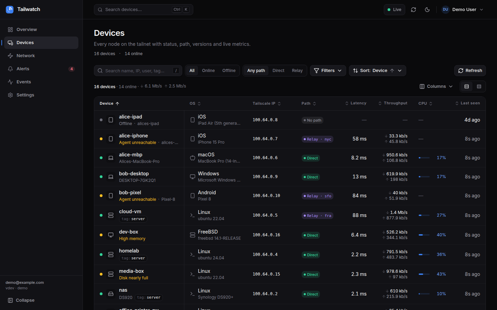
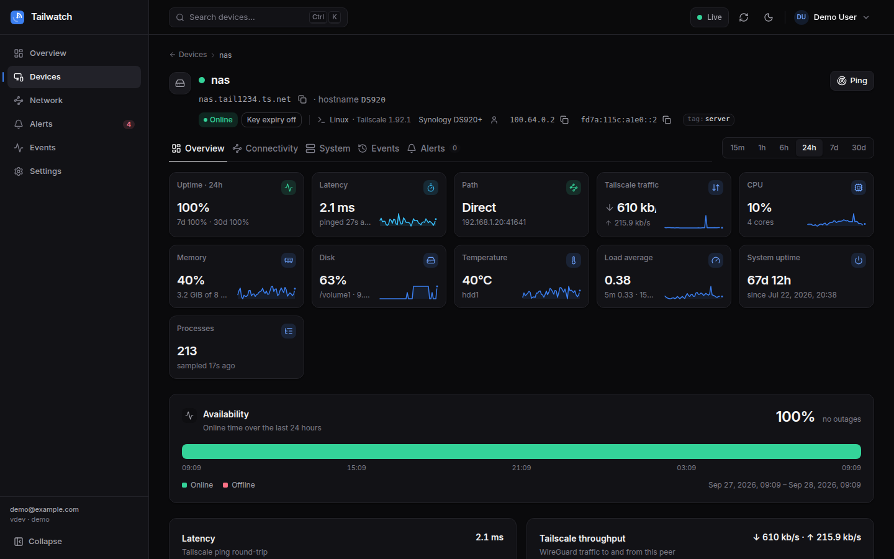
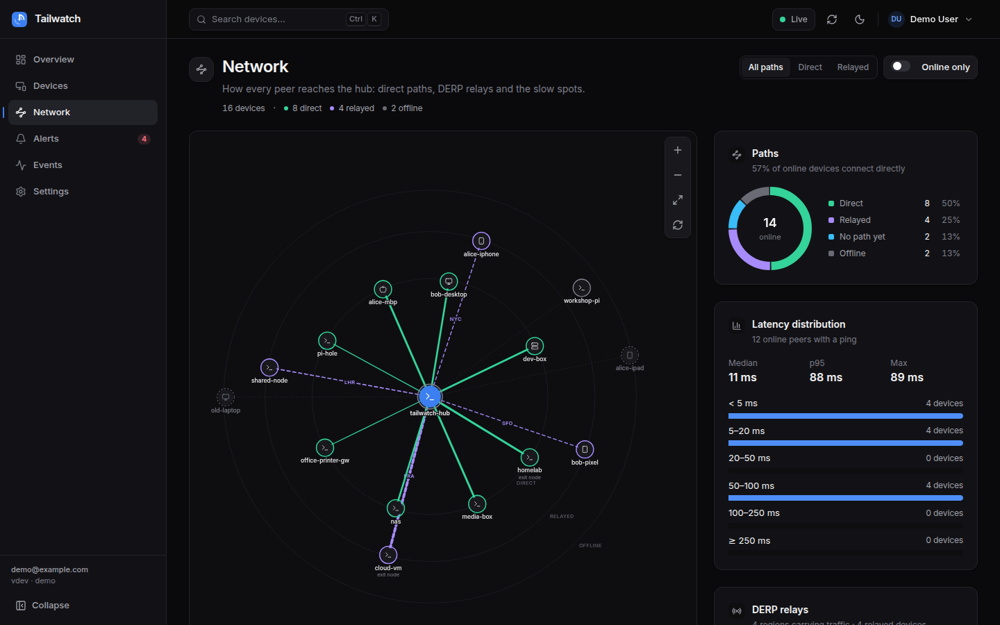
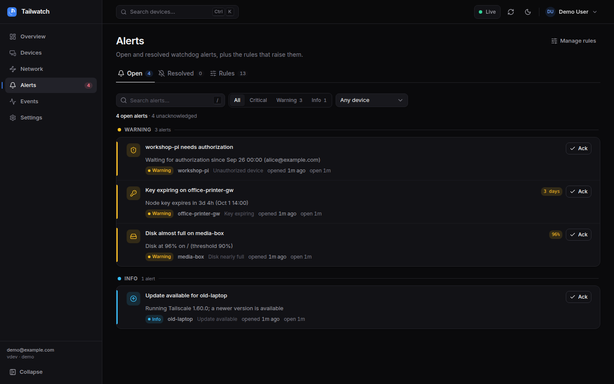
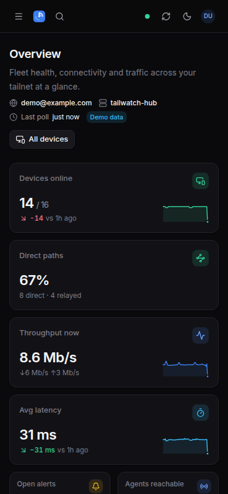

# Tailwatch

**A Tailscale network viewer and watchdog.** One small Go binary on any node
of your tailnet shows every device, how it is connected, how it is doing, and
tells you when something goes wrong — with no passwords, no public ports and
no extra infrastructure.

[](https://github.com/evilgenius79/fable-tailscale/actions/workflows/ci.yml)
[](https://github.com/evilgenius79/fable-tailscale/releases)
[](https://github.com/evilgenius79/fable-tailscale/pkgs/container/tailwatch)
[](go.mod)
[](LICENSE)

Tailwatch is two programs and a web UI:

* **`tailwatch`** (the hub) runs on one node. It reads the local `tailscaled`
  (LocalAPI), optionally the Tailscale control API, and any `tailwatch-agent`
  instances; stores time series in SQLite; evaluates watchdog rules; and
  serves the dashboard over the tailnet, authenticating you by your Tailscale
  identity.
* **`tailwatch-agent`** is an optional, read-only daemon for the devices you
  want CPU / memory / disk / network / temperature / uptime metrics from.
* The **UI** (React + TypeScript) is embedded in the hub binary — nothing else
  to deploy.

## Features

* **Device inventory** — every node in your tailnet with OS, owner, tags, IPs,
  hostname, client version and update-available, key expiry, authorized state,
  exit-node / subnet-router roles, advertised vs. enabled routes, shared-in
  (external) nodes, NAT traits. Searchable and filterable.
* **Live status** — online/offline and "active" (traffic with the hub) pushed
  to the browser over Server-Sent Events after every poll (15s by default).
* **Connection path & latency** — direct WireGuard vs. DERP relay (with the
  relay region), current endpoint, hub→peer disco-ping RTT, per-DERP-region
  latency from the control plane, on-demand ping button.
* **Per-peer bandwidth** — bytes and rates between the hub and each peer, plus
  network-wide totals and sparklines.
* **Agent metrics** — CPU (total, per core, load), memory & swap, disks per
  mount, per-interface counters and rates, temperatures, uptime/boot time,
  process count, local Tailscale version and health, on any device running
  the agent.
* **Uptime history** — availability % over 24h / 7d / 30d, online/offline
  timeline with outage count, time-series charts for every metric at 15s
  resolution for 3h, minute buckets to 24h, and 5-minute rollups for 90 days.
* **Alerts / watchdog** — 13 built-in, tunable rules: device offline, high
  CPU, high memory, disk full (auto-escalates to critical), high latency,
  relay-only, key expiring, update available, agent unreachable, new device,
  unauthorized device, high temperature, high load. Thresholds, "for"
  durations, severities and per-tag / per-device scoping are editable in the
  UI; alerts open, resolve and can be acknowledged.
* **Notifications** — generic JSON webhook (optionally HMAC-signed),
  Slack/Discord-compatible webhook, and [ntfy](https://ntfy.sh); test button
  in the UI.
* **Network map** — force-directed topology of hub ↔ peers with path type,
  relay regions, latency and live rates on the edges.
* **Events timeline** — device online/offline/new/removed/updated/expired,
  path changes, agent reachability, alerts, admin actions, hub start/errors;
  filterable by type and device.
* **Admin actions with audit** — authorize, tag, rename, disable key expiry,
  set routes and delete devices through the Tailscale API; off by default,
  admin-role only, every attempt logged to an audit trail.
* **Demo mode** — `--demo` runs a simulated 16-device tailnet with 24h of
  history so you can try (and develop) it without a tailnet.
* **Security model** — no passwords: identity comes from `tailscaled` WhoIs;
  listens on the Tailscale IP only; strict CSP and CSRF hardening; agents
  authenticate callers and are read-only; secrets live only in the
  environment; hardened systemd units and a distroless container.
  Details in [Security](#security-model).

## Screenshots

Captured from the built-in demo mode (`tailwatch --demo`).

| Overview | Devices |
|---|---|
|  |  |

| Device detail | Network map | Alerts |
|---|---|---|
|  |  |  |

The UI is fully responsive and installable as an app on phones and desktops
(see [Install on your phone](#install-on-your-phone)).

<p align="center"></p>

## Install on your phone

Tailwatch is a Progressive Web App. With the Tailscale app connected on your
phone or tablet, open the hub's address in the browser (for example
`http://tailwatch-hub:8484` or `https://tailwatch-hub.<tailnet>.ts.net` when
TLS is configured) and choose **Install app** / **Add to Home Screen**. It then
launches full-screen from your home screen with its own icon, remembers your
theme, and shows an offline page when the tailnet is unreachable. Live data is
never cached: every open of the app talks to the hub.

* **Android (Chrome, Edge, Samsung Internet):** menu → *Install app*.
* **iOS / iPadOS (Safari):** share sheet → *Add to Home Screen*.
* **Desktop (Chrome, Edge):** the install icon in the address bar.

Phones show status, path, latency, uptime and bandwidth like any other node;
per-device CPU/memory/disk requires the agent, which mobile operating systems
cannot run. For push notifications on a phone, pair the `ntfy` notifier with
the ntfy app.

## Quick start

### Demo in 60 seconds (no tailnet needed)

Requires Go 1.26 and Node 22.

```sh
git clone https://github.com/evilgenius79/fable-tailscale.git && cd fable-tailscale
make build                     # builds the UI, the hub and the agent into ./bin
./bin/tailwatch --demo         # or: make run-demo
```

Open <http://127.0.0.1:8484>. In demo mode authentication is off and you are
`demo@example.com` (admin); every page is populated with simulated data.

### Real tailnet

1. **Pick a hub node** — any always-on machine on the tailnet (a small VM, NAS
   or Raspberry Pi is plenty). Tag it, e.g. `tag:tailwatch-hub`.
2. **Tailscale ACL** — let members reach the hub and the hub reach agents:

   ```jsonc
   {"action": "accept", "src": ["autogroup:member"],   "dst": ["tag:tailwatch-hub:8484"]},
   {"action": "accept", "src": ["tag:tailwatch-hub"],  "dst": ["tag:tailwatch:41820", "autogroup:member:41820"]},
   ```

3. **Run the hub** (systemd, Docker or plain binary — see
   [docs/DEPLOY.md](docs/DEPLOY.md)):

   ```sh
   curl -fsSLO https://raw.githubusercontent.com/evilgenius79/fable-tailscale/main/scripts/install-hub.sh
   less install-hub.sh                                # always read installers first
   sudo sh install-hub.sh --admin you@example.com --operator
   ```

   Then open `http://<hub-tailscale-ip>:8484/` from any device on the
   tailnet. Everything `tailscaled` knows is already there.

4. **Install agents** on the devices you want system metrics from
   ([docs/AGENT.md](docs/AGENT.md)):

   ```sh
   curl -fsSLO https://raw.githubusercontent.com/evilgenius79/fable-tailscale/main/scripts/install-agent.sh
   sudo sh install-agent.sh --allow-tag tag:tailwatch-hub
   ```

5. **Optional:** add a Tailscale OAuth client (`devices:core` read) to
   `/etc/tailwatch/hub.env` for client versions, key expiry, routes and
   DERP latency — and write scopes plus `TAILWATCH_ENABLE_ADMIN_ACTIONS=true`
   if you want to authorize/tag/route devices from the UI.

## How it works

```
                                     your tailnet (WireGuard)
   ┌──────────────┐   HTTP + SSE, identity via WhoIs   ┌──────────────────────── hub node ─────────────────────────┐
   │   browser    │ ─────────────────────────────────▶ │  tailwatch                                                 │
   │ (any device) │ ◀───────────────────────────────── │                                                            │
   └──────────────┘                                    │  httpapi ──▶ SQLite store ◀── collector ◀──▶ tslocal ──▶ tailscaled (LocalAPI: status, WhoIs, ping)
                                                       │    ▲              ▲              │     │                   │
                                                       │    │ SSE          │              │     ├──▶ tsapi ────────▶ api.tailscale.com (optional)
                                                       │   bus ◀── alert engine ◀── ticks ◀─┘     │                   │
                                                       │             │                             └──▶ agentclient ──┼──┐
                                                       │             ▼                                                │  │
                                                       │   webhook / slack / ntfy                                     │  │ GET /v1/metrics (tcp 41820)
                                                       └──────────────────────────────────────────────────────────────┘  │
                                                                                                                         ▼
      ┌─────────────────────────┐    ┌─────────────────────────┐    ┌──────────────────────────────────────────┐
      │ laptop                  │    │ nas                     │    │ phone                                    │
      │ tailwatch-agent         │    │ tailwatch-agent         │    │ (no agent: status, path, latency,        │
      │ cpu · mem · disk · net  │    │ cpu · mem · disk · temp │    │  bandwidth, version, key expiry only)    │
      └─────────────────────────┘    └─────────────────────────┘    └──────────────────────────────────────────┘
```

* **`tslocal`** polls `tailscaled` every `--poll-interval`: peers, online
  state, endpoints, relay, byte counters, and sends disco pings every
  `--ping-interval`. This is the source of truth for online/path/bandwidth.
* **`tsapi`** (optional) polls the control API every `--api-interval` and
  merges client version, authorization, key expiry, routes, DERP latency and
  devices the hub cannot see.
* **`agentclient`** fetches `/v1/metrics` from every online peer on
  `--agent-port`; the hub derives rates from consecutive reports.
* **`collector`** merges everything into one snapshot, computes rates and
  uptime, emits events on transitions, stores samples; hourly rollup + prune.
* **`alerts`** evaluates rules on every tick, opens/resolves alerts, notifies.
* **`httpapi`** serves `/api/v1/*`, SSE `/api/v1/stream` and the embedded UI.

Full package contracts: [docs/ARCHITECTURE.md](docs/ARCHITECTURE.md); HTTP
API: [docs/API.md](docs/API.md).

## Configuration

Flags override environment variables. Lists are comma-separated in the
environment. Run `tailwatch --help` / `tailwatch-agent --help` for the
authoritative list of your version.

### Hub (`tailwatch`)

| Flag | Environment | Default | Description |
|---|---|---|---|
| `--listen` | `TAILWATCH_LISTEN` | `auto` | `auto` = first Tailscale IPv4 + `:8484`; or `host:port`. |
| `--data-dir` | `TAILWATCH_DATA_DIR` | `./data` | Directory for `tailwatch.db` (created 0700). |
| `--socket` | `TAILWATCH_SOCKET` | platform default | `tailscaled` LocalAPI socket path. |
| `--demo` | `TAILWATCH_DEMO` | `false` | Simulated tailnet, auth disabled, 24h backfilled history. |
| `--insecure-no-auth` | `TAILWATCH_INSECURE_NO_AUTH` | `false` | Disable auth; only honoured on a loopback listener. |
| `--admins` | `TAILWATCH_ADMINS` | – | Login names with the admin role. |
| `--admin-tags` | `TAILWATCH_ADMIN_TAGS` | – | Nodes carrying these tags get the admin role. |
| `--viewers` | `TAILWATCH_VIEWERS` | `*` | Login names allowed to view (`*` = any tailnet identity). |
| `--viewer-tags` | `TAILWATCH_VIEWER_TAGS` | – | Nodes carrying these tags may view. |
| `--enable-admin-actions` | `TAILWATCH_ENABLE_ADMIN_ACTIONS` | `false` | Allow device admin actions (needs a control-API credential). |
| `--tailnet` | `TAILWATCH_TAILNET` | `-` | Tailnet for the control API (`-` = the credential's own). |
| – | `TS_API_KEY` | – | Control-API key. Environment only. |
| – | `TS_OAUTH_CLIENT_ID` | – | Control-API OAuth client id. Environment only. |
| – | `TS_OAUTH_CLIENT_SECRET` | – | Control-API OAuth client secret. Environment only. |
| `--api-base-url` | `TAILWATCH_API_BASE_URL` | `https://api.tailscale.com` | Control-API base URL. |
| `--poll-interval` | `TAILWATCH_POLL_INTERVAL` | `15s` | LocalAPI poll (minimum 5s). |
| `--api-interval` | `TAILWATCH_API_INTERVAL` | `60s` | Control-API poll. |
| `--ping-interval` | `TAILWATCH_PING_INTERVAL` | `30s` | Disco ping cadence; `0` disables. |
| `--ping-concurrency` | `TAILWATCH_PING_CONCURRENCY` | `8` | Parallel pings. |
| `--agent-enabled` | `TAILWATCH_AGENT_ENABLED` | `true` | Poll agents. |
| `--agent-port` | `TAILWATCH_AGENT_PORT` | `41820` | Port agents listen on. |
| – | `TAILWATCH_AGENT_TOKEN` | – | Shared token sent as `X-Tailwatch-Token`. Environment only. |
| `--agent-concurrency` | `TAILWATCH_AGENT_CONCURRENCY` | `8` | Parallel agent fetches. |
| `--agent-timeout` | `TAILWATCH_AGENT_TIMEOUT` | `5s` | Per-agent request timeout. |
| `--raw-retention` | `TAILWATCH_RAW_RETENTION` | `48h` | Keep raw samples this long. |
| `--rollup-retention` | `TAILWATCH_ROLLUP_RETENTION` | `2160h` (90d) | Keep 5-minute rollups this long. |
| `--event-retention` | `TAILWATCH_EVENT_RETENTION` | `2160h` (90d) | Keep events/alerts this long. |
| `--webhook-url` | `TAILWATCH_WEBHOOK_URL` | – | Generic JSON webhook for alerts. |
| – | `TAILWATCH_WEBHOOK_SECRET` | – | HMAC-SHA256 key → `X-Tailwatch-Signature`. Environment only. |
| `--slack-webhook-url` | `TAILWATCH_SLACK_WEBHOOK_URL` | – | Slack/Discord-compatible incoming webhook. |
| `--ntfy-url` | `TAILWATCH_NTFY_URL` | – | ntfy topic URL, e.g. `https://ntfy.sh/mytopic`. |
| – | `TAILWATCH_NTFY_TOKEN` | – | ntfy access token. Environment only. |
| `--tls-cert` / `--tls-key` | `TAILWATCH_TLS_CERT` / `TAILWATCH_TLS_KEY` | – | PEM files; when set the hub serves HTTPS (see `tailscale cert`). |
| `--log-level` | `TAILWATCH_LOG_LEVEL` | `info` | `debug` / `info` / `warn` / `error`. |
| `--log-json` | `TAILWATCH_LOG_JSON` | `false` | JSON log lines. |

Secrets (API key, OAuth secret, agent token, webhook secret, ntfy token) are
accepted **only** from the environment or a 0600 `EnvironmentFile`
([`deploy/docker/hub.env.example`](deploy/docker/hub.env.example)); the hub
refuses to start if one is passed as a flag, because command-line arguments are
visible to every local process.

### Agent (`tailwatch-agent`)

| Flag | Environment | Default | Description |
|---|---|---|---|
| `--listen` | `TAILWATCH_AGENT_LISTEN` | `auto` | `auto` = first Tailscale IPv4 + `--port`; or `host:port`. |
| `--port` | `TAILWATCH_AGENT_PORT` | `41820` | Port for `auto`. |
| `--auth` | `TAILWATCH_AGENT_AUTH` | `whois` | `whois` / `token` / `both`. |
| – | `TAILWATCH_AGENT_TOKEN` | – | Shared token. Environment only. |
| `--allow-user` | `TAILWATCH_AGENT_ALLOW_USER` | – | Allowed caller logins (repeatable). |
| `--allow-tag` | `TAILWATCH_AGENT_ALLOW_TAG` | – | Allowed caller tags (repeatable). |
| `--allow-node` | `TAILWATCH_AGENT_ALLOW_NODE` | – | Allowed caller MagicDNS names (repeatable). |
| `--interval` | `TAILWATCH_AGENT_INTERVAL` | `5s` | Sampling interval. |
| `--socket` | `TAILWATCH_AGENT_SOCKET` | platform default | `tailscaled` socket path. |
| `--insecure-listen-any` | `TAILWATCH_AGENT_INSECURE_LISTEN_ANY` | `false` | Allow a non-Tailscale listen address. |

With `whois` and no allow-lists, the agent accepts nodes owned by the same
user as the device and tagged nodes carrying `tag:tailwatch`. Everything
about the agent: [docs/AGENT.md](docs/AGENT.md).

## Security model

* **No passwords, no sessions.** Every request is attributed to a tailnet
  identity by asking `tailscaled` *WhoIs* on the source IP. Tailscale's SSO,
  MFA, device approval and key expiry therefore apply to Tailwatch too.
  Unresolvable callers get `401`.
* **Tailnet-only listener.** The hub binds its Tailscale IP; nothing is
  exposed on LAN or internet interfaces. Reachability is additionally
  controlled by your Tailscale ACL.
* **Roles.** `viewer` (read) and `admin` (rules, acks, audit, device actions)
  from `--admins`/`--admin-tags` and `--viewers`/`--viewer-tags`.
* **CSRF hardening.** Cross-site requests (`Sec-Fetch-Site`, `Origin`
  mismatch) are rejected; every write must carry `X-Requested-With:
  tailwatch`, which no cross-origin page can add without a preflight the hub
  never answers; no CORS headers are ever emitted.
* **CSP and headers.** Strict `Content-Security-Policy` (self only, no inline
  scripts), `frame-ancestors 'none'`, `nosniff`, `no-referrer`, COOP/CORP,
  `Cache-Control: no-store` on the API.
* **Limits.** 64 KiB request bodies, server timeouts, 20 req/s per identity.
* **Agents** listen on their Tailscale IP only, authenticate every caller
  (WhoIs and/or token), allow-list by user/tag/node, rate limit, and expose
  nothing but read-only metrics.
* **Secrets** are environment-only, never logged, never stored, never
  returned by the API.
* **Admin actions** are opt-in, need write-scoped credentials, and are
  audited.
* **Hardened deployment**: systemd units with no capabilities, read-only
  filesystem and syscall filter (`systemd-analyze security` "OK"); distroless
  non-root container; static binaries; `govulncheck` and Dependabot in CI;
  signed, attested releases.

Threat model, hardening guide and vulnerability reporting:
[SECURITY.md](SECURITY.md) and [docs/SECURITY.md](docs/SECURITY.md).

## FAQ

**Does it need the Tailscale control API?**
No. With only the local `tailscaled` you get the inventory, online state,
direct/relay path, latency, bandwidth, exit node / routes, key expiry and
everything the agents report. A control-API credential adds client version and
update-available flags, authorized state, advertised vs. enabled routes,
per-DERP latency, NAT traits, devices your ACL hides from the hub, and
enables admin actions.

**What do I get without agents?**
Everything above except per-device system metrics. Agents add CPU, memory,
disk, per-interface network, temperatures, uptime, process count and the
device's local Tailscale health. Install them only where you want that.

**Windows / macOS support?**
The hub and agent are cross-compiled for Linux (amd64/arm64/arm), macOS
(amd64/arm64), Windows (amd64) and FreeBSD (amd64). Linux with systemd is the
supported hub platform; for agents on macOS use the open-source `tailscaled`
(Homebrew) rather than the App Store app, and on Windows run the `.exe` as a
service. Devices *without* an agent — phones, TVs, Windows/macOS laptops —
are still fully visible. See [docs/AGENT.md](docs/AGENT.md).

**Can everyone on my tailnet see the dashboard?**
Anyone whose device can reach port 8484 (ACL) and who matches `--viewers`
(default `*`). Narrow either for a private dashboard.

**Why can't I put it behind a reverse proxy or `tailscale serve`?**
Identity comes from the source IP. A proxy would make every request look like
localhost and the hub would (correctly) refuse. Use `--tls-cert`/`--tls-key`
with `tailscale cert` for HTTPS instead.

**Resource usage?**
The hub is a single static binary: tens of MB of RAM for a few dozen devices,
negligible CPU, and roughly 60 MB of SQLite per 100 devices at the default
15s/48h raw retention (rollups are tiny). The agent uses ~10–20 MB RAM and
samples every 5s. A Raspberry Pi is a fine hub.

**Does the hub need root?**
No. It needs read access to the `tailscaled` socket (default on Linux) and a
writable data directory. Disco pings additionally need write access — grant
it with `sudo tailscale set --operator=tailwatch` or set
`--ping-interval 0`.

**How is uptime measured?**
From the hub's point of view: a device is "online" in a sample when
`tailscaled` reports it online. Availability percentages are the share of
online samples in the window.

## Development

```sh
make run-demo                 # hub with simulated data on http://127.0.0.1:8484
cd web && npm install && npm run dev   # UI with hot reload on :5173, proxies /api to the hub
make test                     # go test -race + web typecheck/tests
make e2e                      # Playwright against the demo hub
make cross                    # release binaries into dist/
```

Layout: `cmd/` (binaries), `internal/` (packages listed in
[docs/ARCHITECTURE.md](docs/ARCHITECTURE.md)), `web/` (Vite + React +
Tailwind, embedded via `web/embed.go`), `deploy/` (systemd, Docker),
`scripts/` (installers). See [CONTRIBUTING.md](CONTRIBUTING.md).

## License

[MIT](LICENSE) — © 2026 Tailwatch contributors. Tailscale is a trademark of
Tailscale Inc.; this project is not affiliated with or endorsed by Tailscale.
